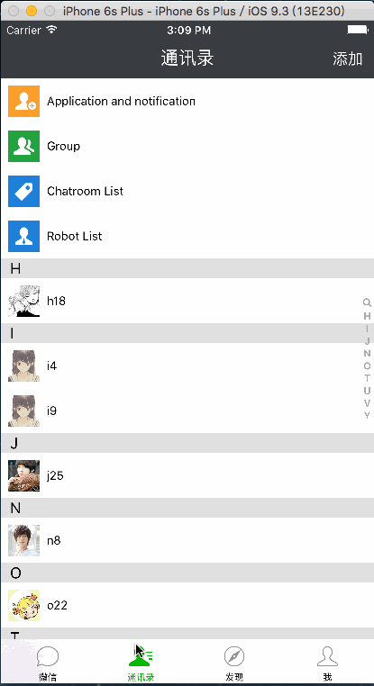

 LZEasemob3（高仿微信）
==================

###说明 (此项目构建于16/7/18,今天16年7月20号就两天时间,所以时间有限,希望大伙在使用过程中遇到BUG请@我一下,我会去认真迭代这款高仿APP)
---
### 1.此版本是有史以来Github上最牛逼的高仿微信项目没有之一,采用MVVM和MVC两种开发架构思想,纯代码开发,这是你们在培训机构学不到的.仅供大家学习使用,不得用于商业用途.最终解释权归作者二哥所有.

### 2.如果各位下客能帮我点STAR,半个月STAR500+,我会陆陆续续发布待实现功能,其实已经做完,一个月STAR1000+我会把微信主要功能全部实现发布出来,两个月STAR2000+我会发布纯Swift版,纯Swift版采用纯代码开发已经做的差不多了.就看大伙的手能不能点STAR了.希望大家不要下完就跑了.作为作者的二哥会很心痛的.
### 3.我之前接触过很多项目,就有一个项目中的朋友圈整个控制器4千行,尼玛4千行了这项目怎么迭代,二哥现在300行解决了朋友圈的问题,还在优化中...
---

##高仿微信计划：

### 1.采用技术点
* pod用于第三方库的管理

* 环信SDK(V3.1.4 2016-07-08)作为此APP DEMO的IM功能

* Masonry用于界面布局

* FMDB用于数据存储

* MJRefresh用于上拉下拉刷新

* MJExtension用于字典转模型

* SDWebImage用于图片展示下载

* ReactiveCocoa用作响应式编程提高代码可读性

* MLLabel用于Label的图文混排

* IM部分采用MVC架构,朋友圈采用MVVM架构

### 2.已经实现功能
* 微信首页（列表数据展示、cell侧滑编辑、点击进入聊天详情界面、发送文字图片和语音）

* 通讯录（联系人字母排序、添加联系人）

* 发现（朋友圈、下拉刷新）

* 我（界面、退出功能）

### 3.待实现功能（）
* 搜索好友

* 朋友圈细节完善

* 扫一扫

* 相册、钱包

* 其他细节实现

* 摇一摇

* 发送朋友圈信息

* 其他

##部分截图
####整体架构图
---

#### 微信
---

#### 通讯录
---

#### 发现
---

#### 我
---

##感恩
>感谢那些开源作者们,我在这里就不一一点名感谢了.有了你们在整个项目的开发进度上提升了不少.也让我学会了很多

##关于我
* QQ  : 648959  
* 微信 : 648959  

## 期待

* 如果在使用过程中遇到BUG，希望你能Issues我，谢谢（或者尝试下载最新的框架代码看看BUG修复没有）
* 如果在使用过程中发现功能不够用，希望你能Issues我，我非常想为这个框架增加更多好用的功能，谢谢
* 如果你想为LZEasemob3输出代码，请拼命Pull Requests我

