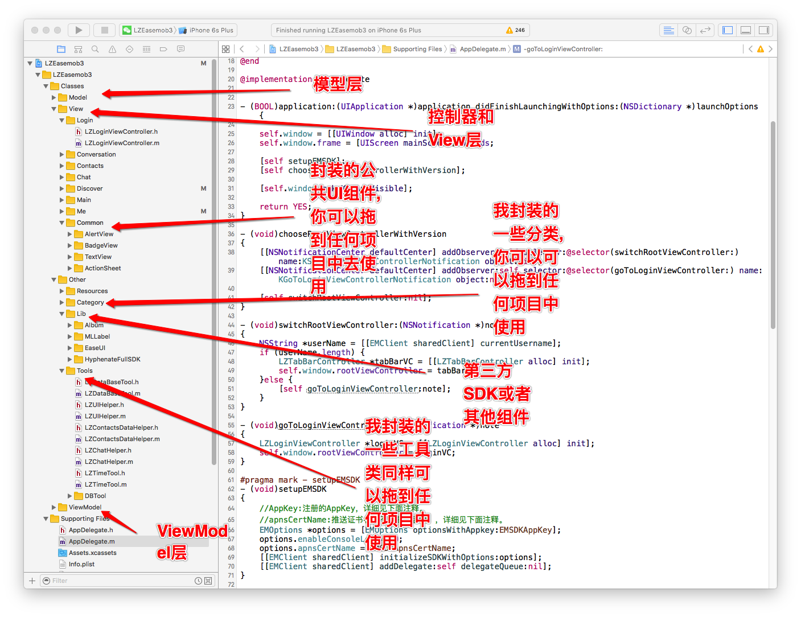
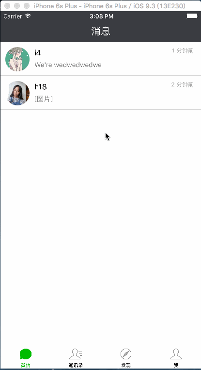
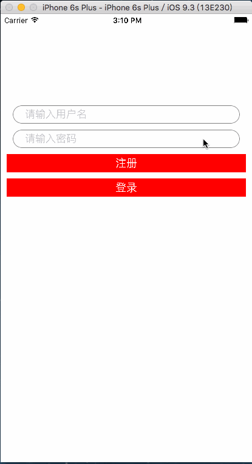
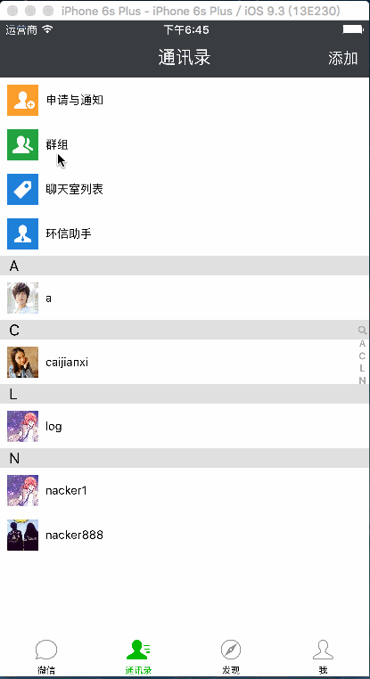
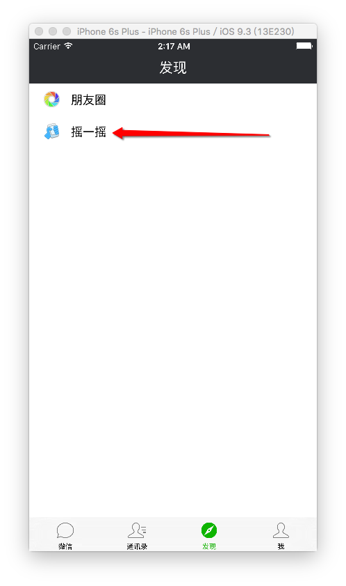
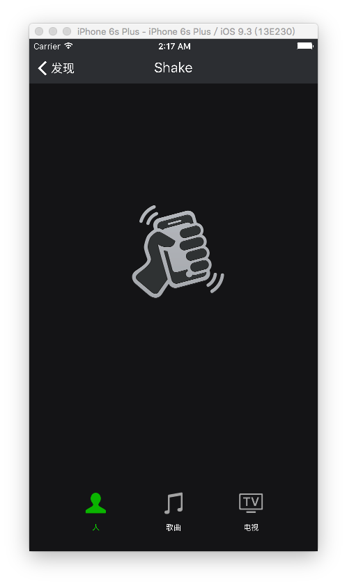

 酷信（高仿微信-环信的人说让我取个屌的名字）
==================

###告示(Notices):

	0.小伙伴们去下载吧,最新版出来了.
	1.LZEasemob3 works on "Xcode 8.0 , iOS 8+ and requires ARC to build. 
	2.如果无法运行项目,请把Xcode 升级为8.0版本以上,ios8.0以上,cocoapods版本最好在0.39.0,最好不要用测试版,二哥亲测是没有问题的.
	3.If not running,check the Resources. http://www.bubuko.com/infodetail-1020786.html
	4.有谁想为开源贡献自己的一份力量的单独联系我.我会在文档加入你的名字.期待你哟!!!
	
	5.谢谢大家一直以来的关注,二哥这段时间太忙所以更新比较慢,大家觉得好的话请推荐给你的朋友们.为感谢大家二哥在STAR 1000前一定把群聊功能加上,请大家继续关注.
	
###安装方式(Installation Method)
* 由于包含实时语音版本SDK静态库超过100M,所以用到了git-lfs,当pod install之前需要安装git-lfs 

		brew install git-lfs
		git lfs init

* First step

		git clone https://github.com/nacker/LZEasemob3.git
* Second step

		pod install
		
* Third step
		
		open  LZEasemob3.xcworkspace

###说明:
	此项目构建于16/7/18,今天16年7月20号就两天时间,所以时间有限,希望大伙在使用过程中遇到BUG请@我一下,我会去认真迭代这款高仿APP

*	此版本是有史以来Github上最牛逼的高仿微信项目没有之一,采用MVVM和MVC两种开发架构思想,纯代码开发,这是你们在培训机构学不到的.仅供大家学习使用,不得用于商业用途.最终解释权归作者二哥所有.

*	如果各位下客能帮我点STAR,半个月STAR500+,我会陆陆续续发布待实现功能,其实已经做完,一个月STAR1000+我会把微信主要功能全部实现发布出来,两个月STAR2000+我会发布纯Swift版,纯Swift版采用纯代码开发已经做的差不多了.就看大伙的手能不能点STAR了.希望大家不要下完就跑了.作为作者的二哥会很心痛的.
*	我之前接触过很多项目,就有一个项目中的朋友圈整个控制器4千行,尼玛4千行了这项目怎么迭代,二哥现在300行解决了朋友圈的问题,还在优化中...

---
##下载地址(分流下载)

###码云: <https://git.oschina.net/iosNacker/LZEasemob3.git>
###GitHub: <https://github.com/nacker/LZEasemob3.git>

---
##关于我
* QQ群  : 527885963  

##高仿微信计划：

### 0.测试账号
	nacker 123456
	h18    123456
	j20    123456
	j25    123456
	t17    123456
	o22    123456
	k5     123456
	y21    123456
	i9     123456
	g14    123456

### 1.采用技术点
* pod用于第三方库的管理

* 环信SDK(V3.1.5 2016-08-26)作为此APP DEMO的IM功能

* Masonry用于界面布局

* FMDB用于数据存储

* MJRefresh用于上拉下拉刷新

* MJExtension用于字典转模型

* SDWebImage用于图片展示下载

* ReactiveCocoa用作响应式编程提高代码可读性

* MLLabel用于Label的图文混排

* IM部分采用MVC架构,朋友圈采用MVVM架构

### 2.已经实现功能
* 微信首页（列表数据展示、cell侧滑编辑、点击进入聊天详情界面、发送文字图片和语音）

* 通讯录（联系人字母排序、添加联系人、群组列表）

* 发现（朋友圈、下拉刷新、朋友圈点赞功能）

* 我（界面、退出功能）

* 摇一摇功能

### 3.待实现功能（）
* 搜索好友

* 朋友圈细节完善

* 扫一扫

* 相册、钱包

* 其他细节实现

* 发送朋友圈信息

* 其他

##部分截图
####整体架构图
---

#### 微信
---

#### 通讯录
---

#### 发现
---

#### 我
---

##--------------------版本更新记录-------------------
###V1.0.5 (2016.10.26)
1. 更新环信SDKV3.2.0 2016.10.25
2. 整体架构更换,让小菜菜们拖我的Classes目录就可以分分钟把IM功能集成起来.

###V1.0.4 (2016.8.29)
1. 解决添加好友逻辑BUG
2. 增加群组列表
3. 更新环信SDKV3.1.5 2016-08-26

 

###V1.0.3 (2016.7.31)
1. 朋友圈点赞功能 
2. 增加摇一摇功能(真机上可用)
3. 修复V1.0.2中残留的Bug
 
 
 

###V1.0.2 (2016.7.22)
1. 增加朋友圈图片浏览器功能
2. 美化登录界面
3. 更换了聊天界面的展示图片功能
4. 修改上一个版本中存在的一些Bug

### V1.0.1(2016.7.20)
1.	工程项目初始化,完善一部分功能

##感恩
>感谢那些开源作者们,我在这里就不一一点名感谢了.有了你们在整个项目的开发进度上提升了不少.也让我学会了很多

## 期待

* 如果在使用过程中遇到BUG，希望你能Issues我，谢谢（或者尝试下载最新的框架代码看看BUG修复没有）
* 如果在使用过程中发现功能不够用，希望你能Issues我，我非常想为这个框架增加更多好用的功能，谢谢
* 如果你想为LZEasemob3输出代码，请拼命Pull Requests我

